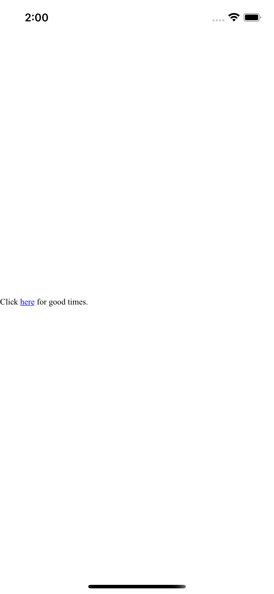
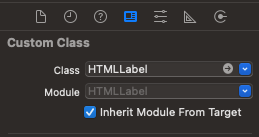

# HTMLLabel

HTMLLabel extend UILabel, supports html-like markups for rich text display. Detecting and handling touches on the link



## Features

1. supports to click html link and open browser
2. supports HTML string

## Usage

### Objective-C

1. Drag HTMLLabel.h and HTMLLabel.m into your project. assign HTMLLabel to UILabel class of Storyboard

``` objective-c
#import "HTMLLabel.h"
```



2. set HTML text and assign delegate to do tapped link function

``` objective-c
[htmlLabel setHTMLText:@""];

htmlLabel.linkDelegate = self
```

3. Inherit delegate to implement link URL function.

``` objective-c
@interface HTMLLabel : UILabel
@end

@implementation HTMLLabel
- (void)tappedLinkTextFunction:(NSURL *)linkString {
	// ...
}
@end
```

### Swift

1. Drag HTMLLabel.h and HTMLLabel.m into your project. assign HTMLLabel to UILabel class of Storyboard


2. set HTML text and assign delegate to do tapped link function

``` swift
htmlLabel.setHTMLText(htmlText: linkStr)
htmlLabel.linkDelegate = self
```

3. Inherit delegate to implement link URL function.

``` swift
class ViewController: UIViewController, HTMLLabelDelegate {
    func tappedLinkTextFunction(linkString: URL) {
        UIApplication.shared.open(linkString, options: [:], completionHandler: nil)
    }
}
```


